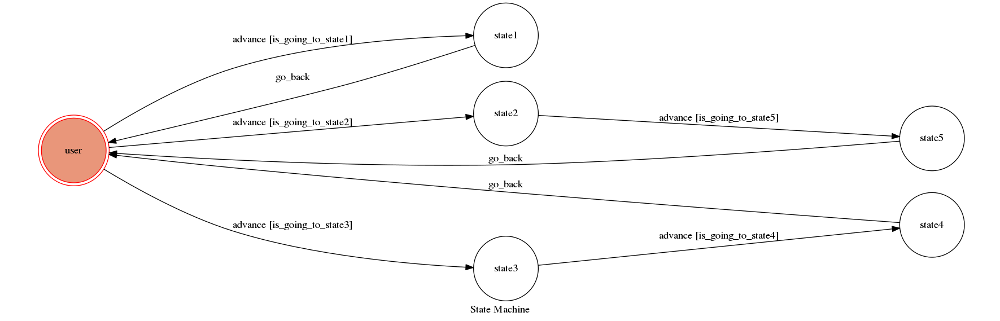

# Train timetable information bot
 
2017 theory of computation final project

A telegram bot based on a finite state machine

environment : ubuntu 16.04 32-bit

## Setup

### Prerequisite
* Python 3

#### Install Dependency
```sh
pip install -r requirements.txt
pip install requests
```

* pygraphviz (For visualizing Finite State Machine)
    * [Setup pygraphviz on Ubuntu](http://www.jianshu.com/p/a3da7ecc5303)

### Secret Data

`API_TOKEN` and `WEBHOOK_URL` in app.py **MUST** be set to proper values.
Otherwise, you might not be able to run your code.

### Run Locally
You can either setup https server or using `ngrok` as a proxy.

**`ngrok` would be used in the following instruction**

```sh
./ngrok http 5000
```

After that, `ngrok` would generate a https URL.

You should set `WEBHOOK_URL` (in app.py) to `your-https-URL/hook`.

#### Run the sever

```sh
python3 app.py
```

## Finite State Machine


## Usage
The initial state is set to `user`.

Every time `user` state is triggered to `advance` to another state, it will `go_back` to `user` state after the bot replies corresponding message.

* user
	* Input: "help"
		* Reply: "請輸入 1.列車時刻查詢 2.查詢車次"

	* Input: "1" or "列車時刻查詢"
		* Reply: 
	       ```sh
                請輸入
                起程站(ex:臺北):
                到達站(ex:高雄):
                日期(ex:2017/06/08):
                時間從(ex:12:00)至(ex:23:59)
			```
		
		* Input: "起程站:臺北 到達站:高雄 日期:2017/06/08 時間從12:00至23:59" or "臺北高雄 2017/06/08 12:00 23:59"
			* Reply:
 	            ```sh
                    請輸入
				    日期(ex:2017/06/08):
				    車次(ex:129):
    	        ```			
			
	* Input: "2" or "查詢車次"
		* Reply: 
		    ```sh
                車種:自強 
                車次:123 
                臺北開車時間:12:00 
                高雄到達時間:16:50 
                行駛時間:04小時50分 
                票價:$ 843 

                車種:自強 
                車次:125 
                臺北開車時間:13:00 
                高雄到達時間:17:50 
                行駛時間:04小時50分 
                票價:$ 843 
                ...
			```
		
		* Input: "日期:2017/06/08 車次:129" or "2017/06/08 129"
			* Reply: 
			 ```sh
                站名:潮州 
                到達時間:14:56 
                開車時間:14:58 
                
                站名:屏東 
                到達時間:15:08 
                開車時間:15:10 
                ...
			 ```

## Author
[litingyang](https://github.com/litingyang)
